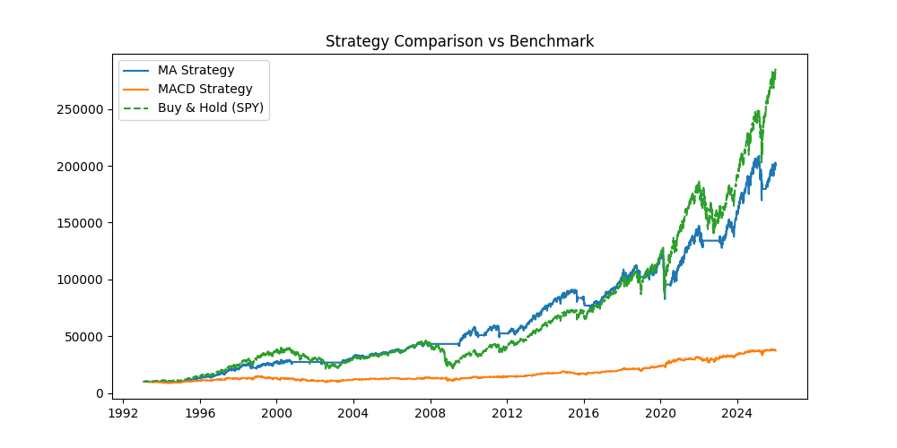

# Systematic Trading Research Project

This repository contains a Python-based framework for developing and testing systematic trading strategies in financial markets.

## Overview

The project focuses on translating price action and market structure concepts into rule-based, testable trading strategies. It includes a modular backtesting engine with performance evaluation tools.

## Features

- Historical data ingestion (Yahoo Finance)
- Strategy development framework
- Moving average crossover strategy (baseline)
- Backtesting engine with transaction costs
- Performance metrics (Sharpe ratio, drawdown, win rate)
- Benchmark comparison against buy & hold

## Current Focus

Ongoing development is focused on:

- Expanding price action and market structure-based strategies
- Building robust backtesting infrastructure
- Implementing risk management rules
- Developing quantitative tools using Python (NumPy, pandas)

## Tech Stack

- Python
- NumPy
- Pandas
- Matplotlib
- yfinance

## Results

Strategy performance vs benchmark:

## Disclaimer

This project is for educational and research purposes only and does not constitute financial advice.